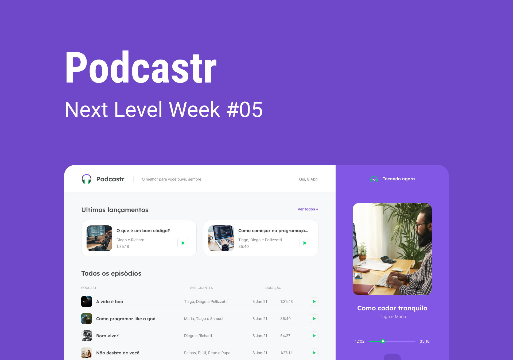

<div align="center">
  
</div>

<br />



<div align="center">
  <p>
    <a href="#-technologies">Technologies</a>&nbsp;&nbsp;&nbsp;|&nbsp;&nbsp;&nbsp;
    <a href="#-getting-started">Getting started</a>&nbsp;&nbsp;&nbsp;|&nbsp;&nbsp;&nbsp;
    <a href="#-license">License</a>
  </p>
</div>

## ✨ Technologies

<div align="center">
  <br />
  
</div>

This project was developed with the following technologies:

- [TypeScript](https://www.typescriptlang.org/)
- [Next.js](https://nextjs.org/)
- [ReactJS](https://reactjs.org/)

## 💻 Getting started

### Requirements

- You need to install both [Node.js](https://nodejs.org/en/download/) and [Yarn](https://yarnpkg.com/) to run this project.

**Clone the project and access the folder**

```bash
$ git clone https://github.com/fariasthomas/nlw05-react-podcastr.git && cd nlw05-react-podcastr
```

**Follow the steps below**

```bash
# Install dependencies
$ yarn install our npm install
# Start the project
$ yarn dev or npm run dev
```

The app will be available for access on your browser at `http://localhost:3000`

## 📝 License

This project is licensed under the MIT License - see the [LICENSE](LICENSE) file for details.

---

by Thomas Farias 👋 [Check out my LinkedIn](https://www.linkedin.com/in/thomas-sf)